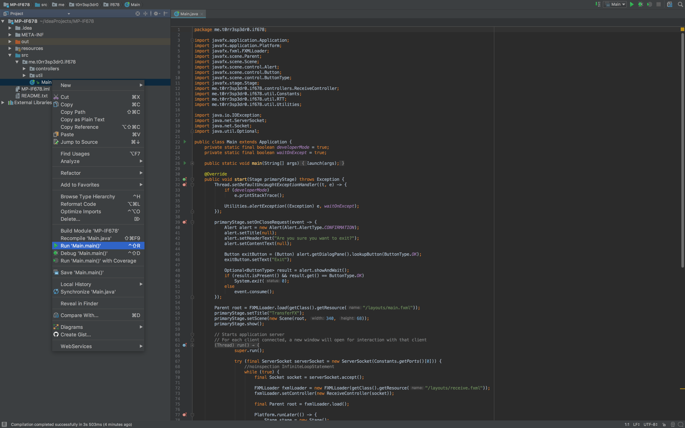

# MP-IF678

## Requirements
- Oracle JDK 8u112
- IntelliJ IDEA

## Execute Project
1. Open projet in IntelliJ IDEA
2. On the left panel open Main class
3. Click with right button over it, and select "Run 'Main.main()'"

